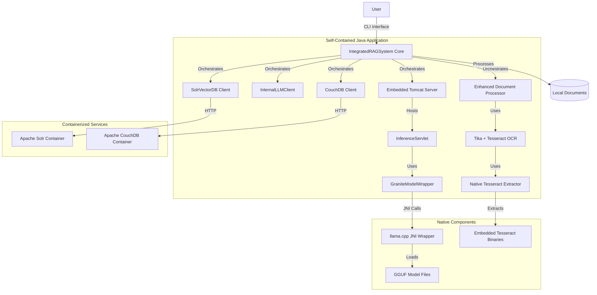
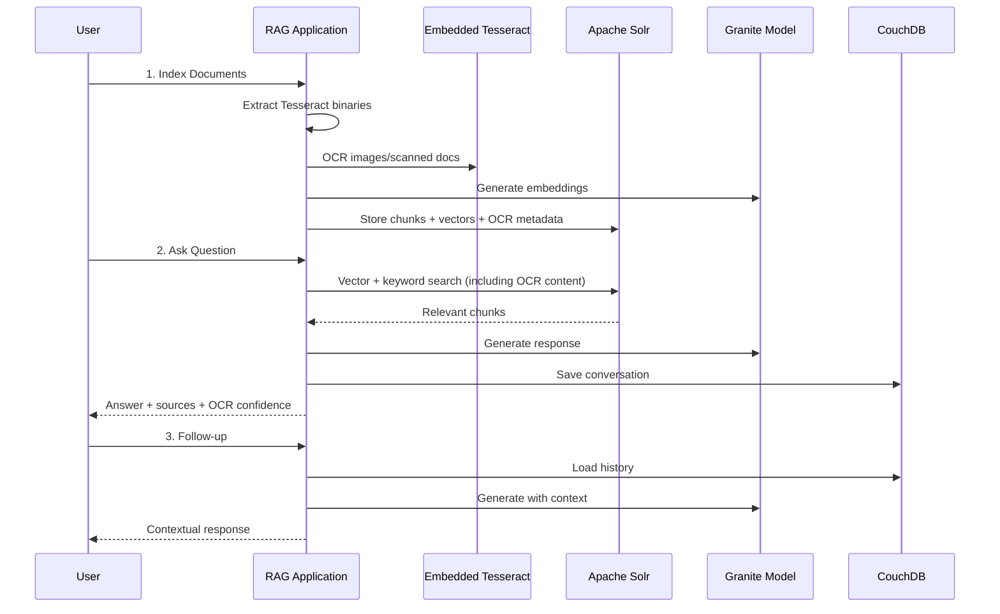

markdown
# Self-Contained RAG Notebook

A fully containerized, local-first RAG (Retrieval-Augmented Generation) application that functions as a personal notebook. Built entirely on open-source technologies with the Apache Software Foundation ecosystem at its core, this application uses a locally-run Granite LLM for generation, Apache Solr for vector search, Apache CouchDB for conversation history, and Apache Tika with embedded Tesseract OCR for comprehensive document processing.

## Table of Contents

- [Architecture Overview](#architecture-overview)
- [Features](#features)
- [Prerequisites](#prerequisites)
- [Quick Start Guide](#quick-start-guide)
- [Tesseract OCR Setup](#tesseract-ocr-setup)
- [Detailed Setup Instructions](#detailed-setup-instructions)
- [Building the Native Components](#building-the-native-components)
- [Running the Application](#running-the-application)
- [Usage Guide](#usage-guide)
- [Troubleshooting](#troubleshooting)
- [Development and Contributing](#development-and-contributing)
- [License](#license)
- [Support and Resources](#support-and-resources)
- [Important Notes](#important-notes)

---

## Architecture Overview

This self-contained application orchestrates multiple components to provide a complete RAG experience:



---

## Features

- **Fully Containerized Backend**: Apache Solr and CouchDB run in optimized Podman/Docker containers
- **Local-First RAG**: Your documents stay on your machine, no data leaves your environment
- **Self-Contained LLM**: IBM Granite model runs locally via embedded Tomcat server
- **Embedded Tesseract OCR**: Self-contained OCR processing without external dependencies
- **Advanced Document Processing**: PDFs, images, scanned documents via Apache Tika + Tesseract
- **Hybrid Vector Search**: Semantic search combined with keyword search using Apache Solr
- **Conversational Memory**: Full conversation history stored in CouchDB
- **Cross-Platform Support**: Works on Windows, Linux, and macOS with embedded native binaries
- **Native Performance**: llama.cpp integration for efficient model inference

---

## Prerequisites

### Required Software

- **Git**: For cloning the repository and submodules
- **Java 17**: OpenJDK 17 or equivalent
- **Apache Maven 3.8+**: For building the project
- **Container Runtime**: One of the following:
  - **Podman** with **podman-compose** (recommended)
  - **Docker** with **Docker Compose**
- **C++ Build Tools**:
  - **CMake 3.15+**
  - **GCC 9+** or **Clang 10+**
  - **Make**

### System Requirements

- **RAM**: Minimum 8GB, recommended 16GB+ (for model inference)
- **Storage**: 10GB+ free space (for models and dependencies)
- **CPU**: Multi-core processor recommended for compilation

---

## Quick Start Guide

### 1. Clone and Initialize Repository

```bash
git clone <repository-url>
cd integrated-rag-system-self-contained

# Initialize the llama.cpp submodule
git submodule add https://github.com/ggerganov/llama.cpp.git
git submodule update --init --recursive
```

### 2. Set Up Tesseract OCR Binaries

The application uses **embedded Tesseract binaries** for all platforms.  
You only need to collect the binaries and tessdata files once.

```bash
# Run the Tesseract setup script (from project root)
chmod +x scripts/collect_binaries_script.sh
./scripts/collect_binaries_script.sh
```

Follow the platform-specific instructions in the [Tesseract OCR Setup](#tesseract-ocr-setup) section to obtain and place the required binaries and language files.

> **Tip:**  
> The script only creates the directory structure and gives you clear instructions for each platform.  
> You do **not** need to install Tesseract system-wide.

### 3. Download the Granite Model

```bash
mkdir -p models
cd models
wget https://huggingface.co/ibm-granite/granite-8b-instruct-v3.2-gguf/resolve/main/granite-8b-instruct-v3.2.Q4_K_M.gguf
cd ..
```

### 4. Prepare Your Documents

```bash
mkdir -p source-documents
# Copy your documents (PDFs, DOCX, images, scanned documents, etc.) to this directory
```

### 5. Build and Run

```bash
# Build the application with native components
mvn clean package -Pnative-build

# Start the containerized services
podman-compose up -d
# or
docker-compose up -d
```

### 6. Configure Solr Schema (Fully Containerized)

Solr schema setup is **fully containerized**—no host-side Solr or curl required.

**A. The schema configuration script is already included at `scripts/configure-solr.sh`.**  
It is automatically mounted into the Solr container by `compose.yml`.

**B. After starting the containers, run the script inside the Solr container:**

```bash
# Find the Solr container name
podman ps   # or docker ps

# Run the script inside the container
podman exec -it <solr_container_name> bash /opt/configure-solr.sh
# or
docker exec -it <solr_container_name> bash /opt/configure-solr.sh
```

> **Note:** Replace `<solr_container_name>` with the actual container name (see `podman ps` or `docker ps`).

This will configure the Solr core for vector search and all required fields for RAG.

---

### 7. Run the Application

You can run the Java application **in a container** (recommended) or locally.

#### **A. Run in a Container (with GUI/X11 support)**

```bash
# Example for Linux with X11 (Docker)
xhost +local:docker
docker run --rm -it \
  --network=host \
  -e DISPLAY=$DISPLAY \
  -v /tmp/.X11-unix:/tmp/.X11-unix \
  -v $PWD/models:/app/models \
  -v $PWD/source-documents:/app/source-documents \
  integrated-rag-system-self-contained:latest
```

- For Podman, use `--network=host` and similar volume mounts.
- On Windows/macOS, use an X server (VcXsrv/XQuartz) and set DISPLAY accordingly.

#### **B. Run Locally (if you prefer)**

```bash
java -Djava.library.path=./llama.cpp/build \
     -Xmx8g \
     -jar target/integrated-rag-system-self-contained-2.0.0.jar
```

> **Note:** The application will launch the GUI by default.  
> If X11 is not available, it will fall back to CLI mode.

---

---

## Tesseract OCR Setup

This application **embeds Tesseract OCR binaries** for all platforms.  
You do **not** need to install Tesseract system-wide.

### Directory Structure

After running `scripts/collect_binaries_script.sh`, you’ll have this structure:

```
src/main/resources/
├── native/
│   ├── windows-x64/     # Windows binaries
│   │   ├── tesseract.exe
│   │   ├── libleptonica-5.dll
│   │   └── libtesseract-5.dll
│   ├── linux-x64/       # Linux binaries
│   │   ├── tesseract
│   │   ├── libtesseract.so.5
│   │   └── libleptonica.so.5
│   └── macos-x64/       # macOS binaries
│       ├── tesseract
│       ├── libtesseract.5.dylib
│       └── libleptonica.5.dylib
└── tessdata/            # Language data files
    ├── eng.traineddata
    ├── fra.traineddata
    └── deu.traineddata
```

### Platform-Specific Binary Collection

Run the script and follow its instructions for your platform:

```bash
./scripts/collect_binaries_script.sh
```

#### Windows (windows-x64)

- Download from [UB-Mannheim Tesseract releases](https://github.com/UB-Mannheim/tesseract/wiki)
- Copy `tesseract.exe`, `libleptonica-5.dll`, `libtesseract-5.dll` to `src/main/resources/native/windows-x64/`

#### Linux (linux-x64)

- Install Tesseract via your package manager (see script output)
- Copy `tesseract`, `libtesseract.so.5`, `libleptonica.so.5` to `src/main/resources/native/linux-x64/`

#### macOS (macos-x64)

- Install via Homebrew (`brew install tesseract`)
- Copy `tesseract`, `libtesseract.5.dylib`, `libleptonica.5.dylib` to `src/main/resources/native/macos-x64/`

### Language Data Files (tessdata)

- Download `.traineddata` files from [tesseract-ocr/tessdata](https://github.com/tesseract-ocr/tessdata)
- Place them in `src/main/resources/tessdata/` (e.g., `eng.traineddata`, `fra.traineddata`, `deu.traineddata`)

### Verification

```bash
find src/main/resources/native -type f
find src/main/resources/tessdata -type f
```

> **Note:**  
> The script does **not** download binaries automatically.  
> You must follow the instructions it prints for your platform.

---

## Detailed Setup Instructions

### Container Configuration

The application uses a `compose.yml` file for **fully containerized deployment** (works with Podman or Docker):

- **Apache Solr 9.6**: Pre-configured with the `documents` core and schema script mounted
- **Apache CouchDB 3.3**: With persistent storage and admin credentials
- **Java RAG App**: Runs in a container, with models and documents mounted as volumes
- **Persistent Volumes**: Data survives container restarts

The compose file is already included in the repository and looks like:

```yaml
version: "3.8"
services:
  solr:
    image: solr:9.6
    ports:
      - "8983:8983"
    volumes:
      - solr_data:/var/solr
      - ./scripts/configure-solr.sh:/opt/configure-solr.sh:ro
    command:
      - solr-precreate
      - documents

  couchdb:
    image: couchdb:3.3
    ports:
      - "5984:5984"
    volumes:
      - couchdb_data:/opt/couchdb/data
    environment:
      - COUCHDB_USER=admin
      - COUCHDB_PASSWORD=password

  rag-app:
    build:
      context: .
      dockerfile: Dockerfile
    depends_on:
      - solr
      - couchdb
    environment:
      - rag.config.graniteModelPath=/app/models/granite-8b-instruct-v3.2.Q4_K_M.gguf
      - rag.config.documentsPath=/app/source-documents
      - rag.config.solrUrl=http://solr:8983/solr
      - rag.config.couchDbUrl=http://couchdb:5984
      - rag.config.couchDbUsername=admin
      - rag.config.couchDbPassword=password
      - rag.config.couchDbDatabase=rag_conversations
      - rag.config.chunkSize=1000
      - rag.config.chunkOverlap=200
      - rag.config.embeddingDimension=384
      - rag.config.tesseractLanguages=eng+fra+deu
      - rag.config.ocrEnabled=true
    volumes:
      - ./models:/app/models
      - ./source-documents:/app/source-documents
    ports:
      - "8080:8080" # If you want to access the embedded Tomcat server

volumes:
  solr_data:
  couchdb_data:
```

### Starting Containerized Services

For **Podman** (recommended):

```bash
podman-compose up -d
podman-compose ps
podman-compose logs -f
```

For **Docker**:

```bash
docker-compose up -d
docker-compose ps
docker-compose logs -f
```

> **Tip:**  
> The Java app container will launch the GUI by default if X11 is available.  
> See [Running the Application](#7-run-the-application) for X11 setup tips.

### Configuring Application Properties

The application reads configuration from `src/main/resources/application.properties` (for local runs)  
or from environment variables (when running in a container).

**Example properties:**

```properties
# Model and document paths (use absolute or container paths)
rag.config.graniteModelPath=/app/models/granite-8b-instruct-v3.2.Q4_K_M.gguf
rag.config.documentsPath=/app/source-documents

# Service URLs (match the compose.yml configuration)
rag.config.solrUrl=http://solr:8983/solr
rag.config.couchDbUrl=http://couchdb:5984

# CouchDB authentication
rag.config.couchDbUsername=admin
rag.config.couchDbPassword=password
rag.config.couchDbDatabase=rag_conversations

# Embedding and chunking settings
rag.config.chunkSize=1000
rag.config.chunkOverlap=200
rag.config.embeddingDimension=384

# Tesseract OCR settings (automatically configured)
rag.config.tesseractLanguages=eng+fra+deu
rag.config.ocrEnabled=true
```

> **Note:**  
> When running in a container, these are set via environment variables in `compose.yml`.

---

## Building the Native Components

The application requires building native components for optimal performance:

### 1. Build llama.cpp Library

```bash
cd llama.cpp
mkdir -p build && cd build
cmake .. -DBUILD_SHARED_LIBS=ON -DCMAKE_BUILD_TYPE=Release
make -j$(nproc)
ls -la libllama.so  # On Linux
ls -la libllama.dylib  # On macOS
cd ../..
```

### 2. Build Java Application with Native Profile

```bash
mvn clean package -Pnative-build
```

---

## Running the Application

### 1. Start Backend Services

```bash
podman-compose up -d
sleep 30
podman exec -it <solr_container_name> bash /opt/configure-solr.sh
```

### 2. Launch the RAG Application

```bash
java -Djava.library.path=./llama.cpp/build \
     -Xmx8g \
     -jar target/integrated-rag-system-self-contained-2.0.0.jar
```

---

## Usage Guide

### Initial Document Indexing

1. **Select “Index Documents”** from the main menu
2. The system will:
   - Process all files in your `source-documents` directory
   - Use Apache Tika for standard document extraction
   - Apply Tesseract OCR for images and scanned documents
   - Generate embeddings using the local Granite model
   - Store chunks and vectors in Solr
   - Display progress and OCR statistics

### Document Processing Capabilities

- **Standard Documents**: PDF, DOCX, TXT, HTML
- **Images with Text**: PNG, JPEG, TIFF, BMP
- **Scanned Documents**: PDF with embedded images
- **Multi-language OCR**: English, French, German (configurable)
- **High-quality OCR**: 300 DPI processing for optimal text extraction

### Querying Your Documents

1. **Select “Ask a Question”** from the main menu
2. **Enter your question** in natural language
3. The system will:
   - Search for relevant document chunks (including OCR’d content)
   - Generate a contextual response using Granite
   - Display the answer with source citations
   - Save the conversation to CouchDB

### Follow-up Questions

- Ask follow-up questions like “Can you elaborate on that?”
- Reference previous responses: “What did you mean by X?”
- The conversation history enhances response quality

### OCR-Enhanced Features

- **Automatic OCR Detection**: Images and scanned documents are processed automatically
- **Multi-language Recognition**: Configurable language support
- **Confidence Scoring**: OCR quality metrics stored with documents
- **Fallback Processing**: Standard text extraction for non-OCR documents

### Usage Flow



---

## Troubleshooting

### Common Issues

**Container Startup Issues**:

```bash
podman-compose ps
podman-compose logs solr
podman-compose logs couchdb
podman-compose down && podman-compose up -d
```

**Model Loading Errors**:

- Verify model file path in `application.properties`
- Ensure sufficient RAM (8GB+ recommended)
- Check model file integrity

**Tesseract OCR Issues**:

- Verify native binaries are properly extracted
- Check tessdata files are present and not corrupted
- Monitor memory usage during OCR processing
- Look for extraction log messages at startup

**Build Failures**:

```bash
mvn clean
mvn package -Pnative-build -X
java -version
mvn -version
```

### Tesseract-Specific Troubleshooting

- **Library not found errors**: Ensure all required files are present for your platform and versions match.
- **Permission denied errors**: The extractor sets execute permissions; verify temp directory permissions.
- **OCR quality issues**: Check input image resolution (300 DPI recommended), verify language data files, monitor OCR confidence scores.
- **Large JAR size**: Remove unused platform binaries/languages if targeting specific platforms only.

### Performance Tuning

```bash
java -Djava.library.path=./llama.cpp/build -Xmx16g -jar target/integrated-rag-system-self-contained-2.0.0.jar
podman-compose up -d --memory 4g
```

---

## Development and Contributing

### Project Structure

```
integrated-rag-system-self-contained/
├── compose.yml
├── pom.xml
├── collect_binaries_script.sh
├── llama.cpp/
├── models/
├── source-documents/
├── src/main/java/com/notebooklm/
├── src/main/resources/
│   ├── native/
│   ├── tessdata/
│   └── application.properties
├── scripts/
├── docs/
│   ├── embedded_tesseract_setup.md
│   └── readme_tesseract.md
└── target/
```

### Key Components

- **IntegratedRAGSystem**: Main application orchestrator
- **GraniteModelWrapper**: JNI interface to llama.cpp
- **EnhancedDocumentProcessor**: Tika + Tesseract integration
- **TesseractNativeExtractor**: Runtime extraction of embedded binaries
- **SolrVectorDB**: Vector search implementation
- **CouchDBClient**: Conversation persistence
- **LLMServer**: Embedded Tomcat inference server

### Contributing Guidelines

1. **Fork the repository**
2. **Create a feature branch**: `git checkout -b feature/your-feature`
3. **Test with multiple document types** including images and scanned documents
4. **Update documentation** as needed, especially for OCR-related changes
5. **Ensure cross-platform compatibility** if modifying native components
6. **Submit a pull request**

---

## License

This project is licensed under the Apache License, Version 2.0.

### Third-Party Components

|Component     |License   |Purpose              |
|--------------|----------|---------------------|
|Apache Solr   |Apache 2.0|Vector search engine |
|Apache CouchDB|Apache 2.0|Document database    |
|Apache Tika   |Apache 2.0|Document processing  |
|Apache Tomcat |Apache 2.0|Embedded web server  |
|Tesseract OCR |Apache 2.0|OCR processing engine|
|llama.cpp     |MIT       |LLM inference engine |
|IBM Granite   |Custom    |Language model       |

---

## Support and Resources

- **Documentation**: Check the `docs/` directory for detailed guides
  - `embedded_tesseract_setup.md`: Comprehensive Tesseract integration guide
  - `readme_tesseract.md`: Platform-specific binary collection instructions
- **Issues**: Report bugs and feature requests via GitHub Issues
- **Discussions**: Join community discussions for help and ideas
- **Apache Software**: Learn more about the Apache ecosystem at [apache.org](https://apache.org)
- **Tesseract OCR**: Official documentation at [tesseract-ocr.github.io](https://tesseract-ocr.github.io)

---

## Important Notes

### File Sizes and Performance

- Native binaries add ~20-50MB per platform
- Language data files are ~10-15MB each
- Final JAR size: ~150-300MB depending on included platforms and languages
- First-run extraction adds ~2-5 seconds to startup time
- OCR processing may require additional memory and processing time

### Platform Support

- Windows (x64): Full support with embedded binaries
- Linux (x64): Full support with embedded binaries
- macOS (x64): Full support with embedded binaries
- The application auto-detects platform and extracts appropriate binaries

### OCR Capabilities

- Supports 100+ languages via tessdata files
- Handles images, scanned PDFs, and mixed document types
- Provides confidence scoring for OCR quality assessment
- Integrates seamlessly with existing document processing pipeline

---

**Ready to get started?**
Follow the [Quick Start Guide](#quick-start-guide) to have your local RAG notebook with advanced OCR capabilities running in minutes!
